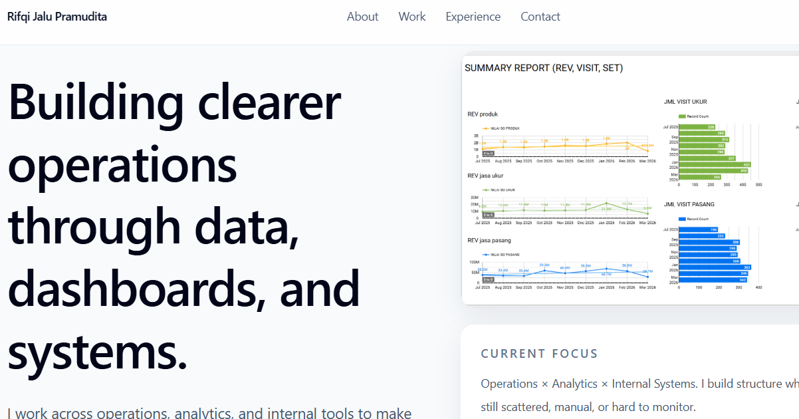

# Rifqi Jalu Pramudita Portfolio

Personal portfolio website built to present my work across operations, analytics, dashboards, workflow design, and internal systems.

Live site:
https://rifqi-portfolio-pi.vercel.app/

## Preview

## About This Project

This portfolio highlights the kind of work I do at the intersection of:
- operations
- analytics
- dashboarding
- workflow / internal system design

The site is designed as a single-page portfolio with bilingual content, project screenshots, responsive layout, and a cleaner presentation of selected work.

## Featured Work

### 1. Structured Field Operations Control System
An internal AppSheet-based field operations system used to improve visibility, standardize technician activity tracking, and reduce dependency on WhatsApp-based updates.

### 2. Standardized Reporting and Dashboarding
Operational reporting and dashboard structures built to make field conditions easier to understand across teams and management through more structured visibility.

## Tech Stack

- React
- TypeScript
- Vite
- Tailwind CSS
- Framer Motion
- Vercel

## Local Development

To run this project locally:
npm install

npm run dev

## Production Build
npm run build

npm run preview

## Project Structure
src/        main React application files

public/     static assets such as images, PDF, favicon, and preview image

## Notes
This repository contains the source code for my portfolio website.

The portfolio is still being improved gradually, including content refinement, polish, and domain setup.

This project is also part of my personal learning journey in web development. I come from a non-web background, so I am building and improving this portfolio step by step while learning along the way. Constructive suggestions are always welcome.

## Contacts
email : rifqijalu@gmail.com

LinkedIn : https://linkedin.com/in/rifqijalu
